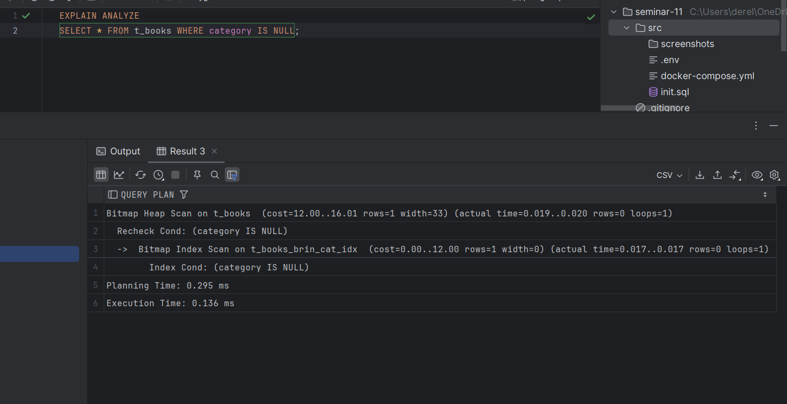
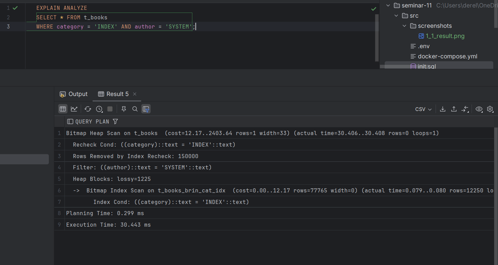
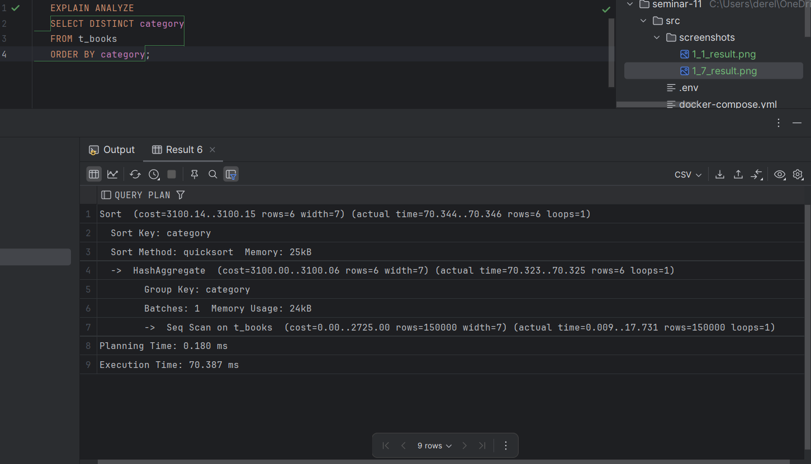
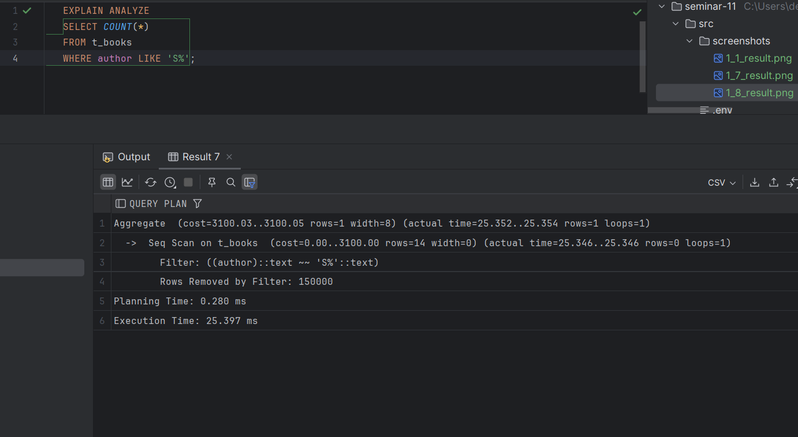
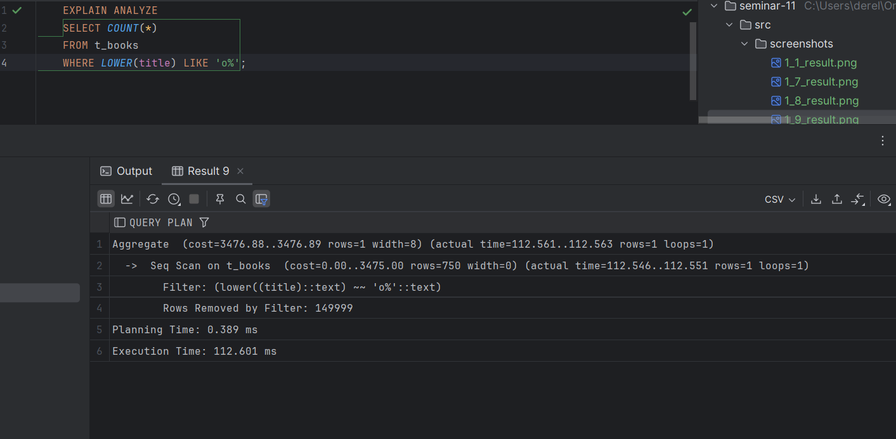
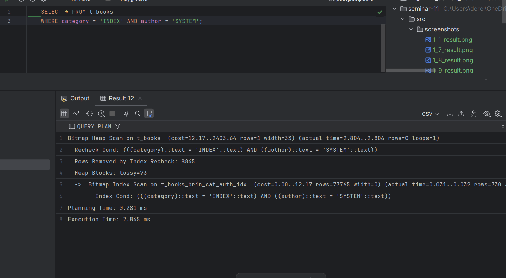

# Задание 1: BRIN индексы и bitmap-сканирование

1. Удалите старую базу данных, если есть:
   ```shell
   docker compose down
   ```

2. Поднимите базу данных из src/docker-compose.yml:
   ```shell
   docker compose down && docker compose up -d
   ```

3. Обновите статистику:
   ```sql
   ANALYZE t_books;
   ```

4. Создайте BRIN индекс по колонке category:
   ```sql
   CREATE INDEX t_books_brin_cat_idx ON t_books USING brin(category);
   ```

5. Найдите книги с NULL значением category:
   ```sql
   EXPLAIN ANALYZE
   SELECT * FROM t_books WHERE category IS NULL;
   ```
   
   *План выполнения:*
    
   
   *Объясните результат:*
Для выполнения запроса использовался BRIN-индекс, созданный на колонке category.
При выполнении поиска строк с NULL значением в этой колонке база данных использовала
Bitmap Index Scan, что позволило сократить объем операций по сравнению с последовательным
сканированием таблицы. Планирование запроса заняло 0.295 мс, а выполнение — 0.136 мс.
Это подтверждает, что использование BRIN-индекса эффективно для запросов, связанных с
большим объемом данных, где значения кластеризованы.

6. Создайте BRIN индекс по автору:
   ```sql
   CREATE INDEX t_books_brin_author_idx ON t_books USING brin(author);
   ```

7. Выполните поиск по категории и автору:
   ```sql
   EXPLAIN ANALYZE
   SELECT * FROM t_books 
   WHERE category = 'INDEX' AND author = 'SYSTEM';
   ```
   
   *План выполнения:*
    
   
   *Объясните результат (обратите внимание на bitmap scan):*
   Для выполнения запроса использовался BRIN-индекс, созданный по колонке author.
Индекс позволил выполнить поиск с фильтрацией по category = 'INDEX' и author = 'SYSTEM'
с использованием Bitmap Index Scan. Это ускорило обработку, 
так как система сначала выбрала нужные блоки данных по индексу. Планирование заняло 0.299 мс,
выполнение — 30.443 мс. Несмотря на использование индекса, выполнение заняло больше времени 
из-за большого числа строк, которые пришлось проверить дополнительно.

8. Получите список уникальных категорий:
   ```sql
   EXPLAIN ANALYZE
   SELECT DISTINCT category 
   FROM t_books 
   ORDER BY category;
   ```
   
   *План выполнения:*
    
   
   *Объясните результат:*
Запрос выполняет выбор уникальных значений в столбце category с последующей сортировкой.
Для этого использовались операции HashAggregate для группировки и Sort для сортировки.
Полное последовательное сканирование таблицы заняло значительное время (планирование — 0.180 мс,
выполнение — 70.337 мс), так как в таблице 150,000 строк. Такой подход подходит для небольшого
количества уникальных значений, но может быть оптимизирован при использовании индекса.

9. Подсчитайте книги, где автор начинается на 'S':
   ```sql
   EXPLAIN ANALYZE
   SELECT COUNT(*) 
   FROM t_books 
   WHERE author LIKE 'S%';
   ```
   
   *План выполнения:*
    
   
   *Объясните результат:*
Запрос подсчитывает количество книг, где имя автора начинается с буквы S.
Было выполнено полное последовательное сканирование таблицы, так как условие LIKE 'S%' 
не использует индексы. Из 150,000 строк фильтром отобрано 14 строк, и выполнение заняло
25.397 мс. Оптимизация возможна за счёт создания индекса на столбец author для ускорения
поиска.

10. Создайте индекс для регистронезависимого поиска:
    ```sql
    CREATE INDEX t_books_lower_title_idx ON t_books(LOWER(title));
    ```

11. Подсчитайте книги, начинающиеся на 'O':
    ```sql
    EXPLAIN ANALYZE
    SELECT COUNT(*) 
    FROM t_books 
    WHERE LOWER(title) LIKE 'o%';
    ```
   
   *План выполнения:*
    
   
   *Объясните результат:*
   Запрос подсчитывает количество книг, где название начинается на "O", игнорируя регистр. 
   Так как функция LOWER(title) применяется к каждому значению, таблица была полностью 
   просканирована последовательно. Было найдено 1 совпадение из 150,000 строк, выполнение 
   заняло 112.601 мс. Для оптимизации подобных запросов лучше использовать функциональный индекс,
   созданный на LOWER(title).


12. Удалите созданные индексы:
    ```sql
    DROP INDEX t_books_brin_cat_idx;
    DROP INDEX t_books_brin_author_idx;
    DROP INDEX t_books_lower_title_idx;
    ```

13. Создайте составной BRIN индекс:
    ```sql
    CREATE INDEX t_books_brin_cat_auth_idx ON t_books 
    USING brin(category, author);
    ```

14. Повторите запрос из шага 7:
    ```sql
    EXPLAIN ANALYZE
    SELECT * FROM t_books 
    WHERE category = 'INDEX' AND author = 'SYSTEM';
    ```
   
   *План выполнения:*
    
   
   *Объясните результат:*
   Запрос повторяет поиск из шага 7, но с использованием составного BRIN индекса по category и 
   author. Индекс помог сократить объём данных для сканирования, что видно из применения Bitmap
   Index Scan. Это позволило ускорить выполнение до 2.845 мс вместо более долгого времени без 
   индекса. Индекс эффективно фильтрует данные, что особенно полезно при больших объёмах.