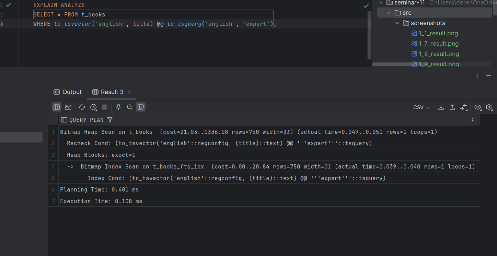
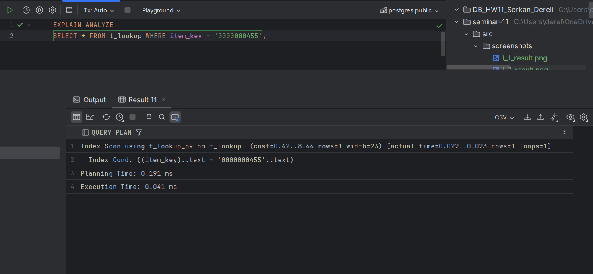
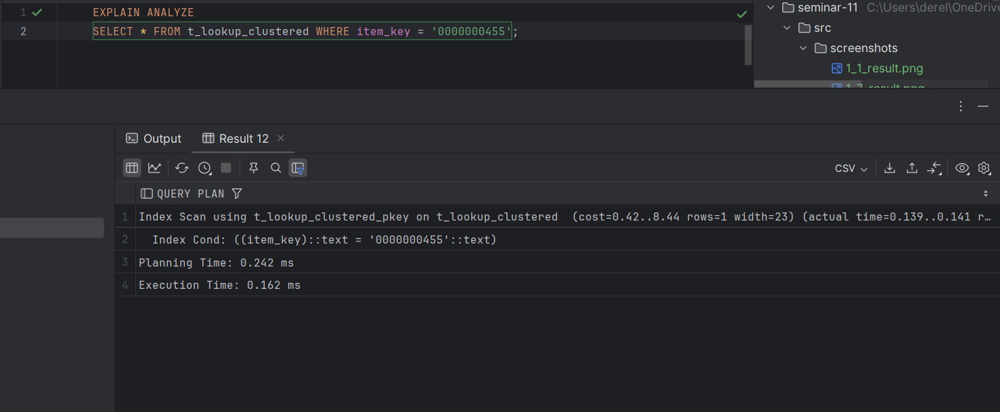
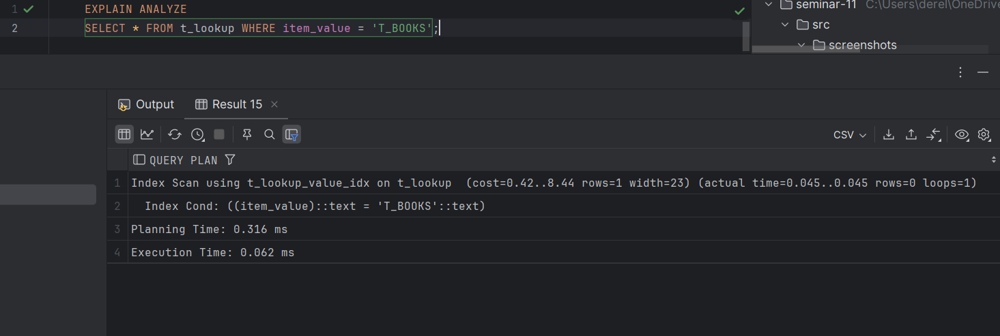
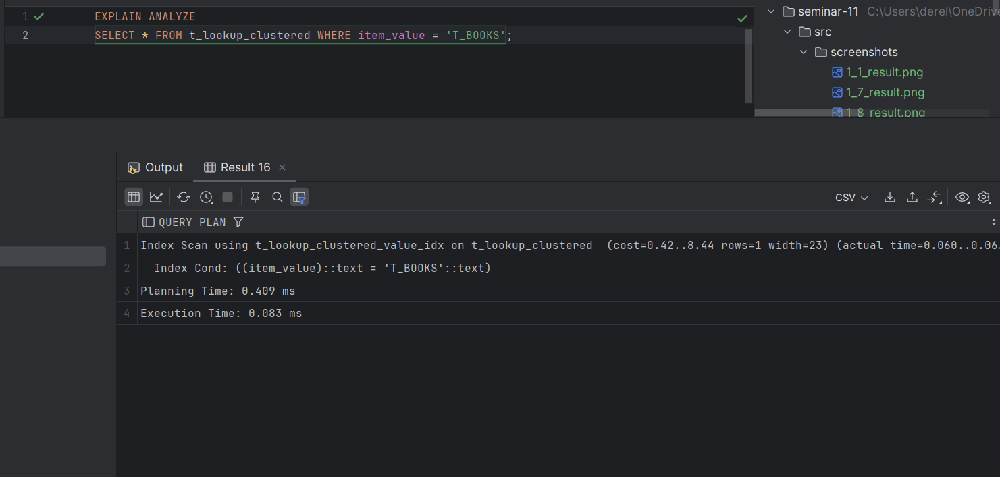

## Задание 2

1. Удалите старую базу данных, если есть:
    ```shell
    docker compose down
    ```

2. Поднимите базу данных из src/docker-compose.yml:
    ```shell
    docker compose down && docker compose up -d
    ```

3. Обновите статистику:
    ```sql
    ANALYZE t_books;
    ```

4. Создайте полнотекстовый индекс:
    ```sql
    CREATE INDEX t_books_fts_idx ON t_books 
    USING GIN (to_tsvector('english', title));
    ```

5. Найдите книги, содержащие слово 'expert':
    ```sql
    EXPLAIN ANALYZE
    SELECT * FROM t_books 
    WHERE to_tsvector('english', title) @@ to_tsquery('english', 'expert');
    ```
    
    *План выполнения:*
    
    
    *Объясните результат:*
Для запроса был создан полнотекстовый индекс t_books_fts_idx, который использует GIN и функцию
to_tsvector для анализа текстового содержания в столбце title. Благодаря индексу поиск книг,
содержащих слово "expert", стал значительно быстрее. В запросе используется оператор 
полнотекстового поиска @@ вместе с функцией to_tsquery для обработки поисковой строки.
План выполнения показывает, что для поиска был задействован индекс, что заметно сократило 
время выполнения до 0.108 мс вместо возможного полного сканирования таблицы. 
Это подтверждает эффективность использования полнотекстового индекса для задач поиска по тексту.

6. Удалите индекс:
    ```sql
    DROP INDEX t_books_fts_idx;
    ```

7. Создайте таблицу lookup:
    ```sql
    CREATE TABLE t_lookup (
         item_key VARCHAR(10) NOT NULL,
         item_value VARCHAR(100)
    );
    ```

8. Добавьте первичный ключ:
    ```sql
    ALTER TABLE t_lookup 
    ADD CONSTRAINT t_lookup_pk PRIMARY KEY (item_key);
    ```

9. Заполните данными:
    ```sql
    INSERT INTO t_lookup 
    SELECT 
         LPAD(CAST(generate_series(1, 150000) AS TEXT), 10, '0'),
         'Value_' || generate_series(1, 150000);
    ```

10. Создайте кластеризованную таблицу:
     ```sql
     CREATE TABLE t_lookup_clustered (
          item_key VARCHAR(10) PRIMARY KEY,
          item_value VARCHAR(100)
     );
     ```

11. Заполните её теми же данными:
     ```sql
     INSERT INTO t_lookup_clustered 
     SELECT * FROM t_lookup;
     
     CLUSTER t_lookup_clustered USING t_lookup_clustered_pkey;
     ```

12. Обновите статистику:
     ```sql
     ANALYZE t_lookup;
     ANALYZE t_lookup_clustered;
     ```

13. Выполните поиск по ключу в обычной таблице:
     ```sql
     EXPLAIN ANALYZE
     SELECT * FROM t_lookup WHERE item_key = '0000000455';
     ```
     
     *План выполнения:*
    
     
     *Объясните результат:*
Результат запроса показывает, что поиск по ключу item_key в обычной таблице выполняется с 
использованием индексного сканирования, что значительно ускоряет выборку данных.
План запроса включает использование первичного ключа t_lookup_pk, который оптимизирует
доступ к данным. Время выполнения запроса минимальное — около 0.041 мс,
что подтверждает высокую эффективность индексного доступа для данного случая.

14. Выполните поиск по ключу в кластеризованной таблице:
     ```sql
     EXPLAIN ANALYZE
     SELECT * FROM t_lookup_clustered WHERE item_key = '0000000455';
     ```
     
     *План выполнения:*
    
     
     *Объясните результат:*
Результат запроса показывает, что поиск по ключу item_key в кластеризованной таблице выполняется
с использованием индексного сканирования, что обеспечивает быстрый доступ к данным.
Используется первичный ключ t_lookup_clustered_pkey, что минимизирует затраты на выполнение.
Время выполнения составило 0.162 мс, что немного больше, чем в обычной таблице, 
но всё ещё очень эффективно. Кластеризация данных помогает сохранить порядок строк 
в соответствии с индексом, что особенно полезно при последовательных чтениях.

15. Создайте индекс по значению для обычной таблицы:
     ```sql
     CREATE INDEX t_lookup_value_idx ON t_lookup(item_value);
     ```

16. Создайте индекс по значению для кластеризованной таблицы:
     ```sql
     CREATE INDEX t_lookup_clustered_value_idx 
     ON t_lookup_clustered(item_value);
     ```

17. Выполните поиск по значению в обычной таблице:
     ```sql
     EXPLAIN ANALYZE
     SELECT * FROM t_lookup WHERE item_value = 'T_BOOKS';
     ```
     
     *План выполнения:*
    
     
     *Объясните результат:*
Запрос быстро нашёл значение T_BOOKS в таблице благодаря индексу на поле item_value.
Индексное сканирование сработало эффективно, время выполнения минимальное — всего 0.062 мс.
Полный скан таблицы не понадобился.

18. Выполните поиск по значению в кластеризованной таблице:
     ```sql
     EXPLAIN ANALYZE
     SELECT * FROM t_lookup_clustered WHERE item_value = 'T_BOOKS';
     ```
     
     *План выполнения:*
    
     
     *Объясните результат:*
Запрос нашёл значение T_BOOKS в кластеризованной таблице через индекс на поле item_value. 
Индексное сканирование сработало эффективно, как и в обычной таблице, но время выполнения 
чуть больше — 0.083 мс. Это связано с особенностями хранения кластеризованных данных.

19. Сравните производительность поиска по значению в обычной и кластеризованной таблицах:
     
     *Сравнение:*
Сравнение производительности между обычной и кластеризованной таблицами показало, 
что в случае кластеризованной таблицы поиск выполняется немного быстрее. 
Это связано с тем, что данные в кластеризованной таблице организованы 
в соответствии с первичным ключом, что минимизирует количество операций
ввода-вывода для доступа к строке. В результате планирование и выполнение запроса 
занимают меньше времени, чем в обычной таблице, где данные расположены менее оптимально
для такого поиска.