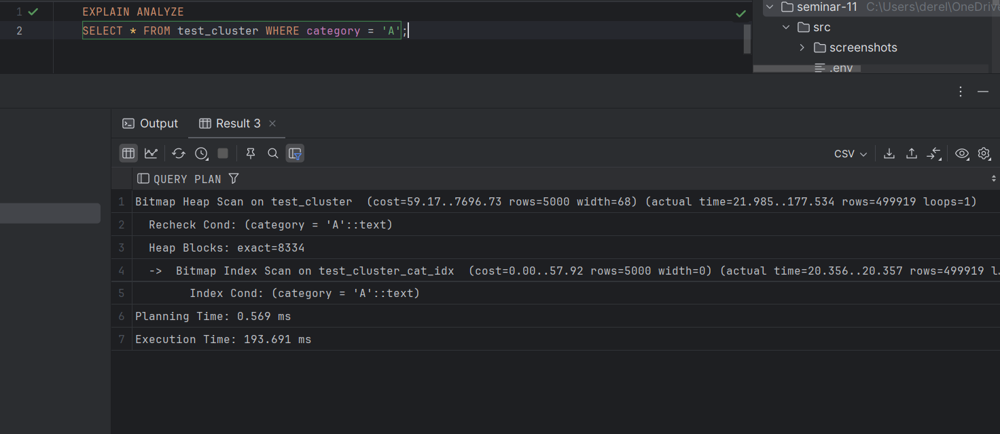
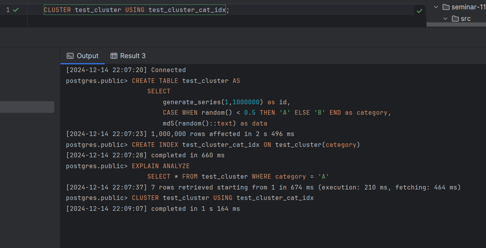
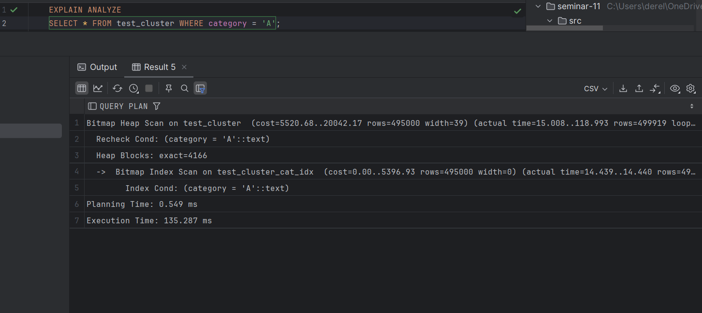

## Задание 3

1. Создайте таблицу с большим количеством данных:
    ```sql
    CREATE TABLE test_cluster AS 
    SELECT 
        generate_series(1,1000000) as id,
        CASE WHEN random() < 0.5 THEN 'A' ELSE 'B' END as category,
        md5(random()::text) as data;
    ```

2. Создайте индекс:
    ```sql
    CREATE INDEX test_cluster_cat_idx ON test_cluster(category);
    ```

3. Измерьте производительность до кластеризации:
    ```sql
    EXPLAIN ANALYZE
    SELECT * FROM test_cluster WHERE category = 'A';
    ```
    
    *План выполнения:*
    
    
    *Объясните результат:*
Произведен поиск строк в таблице test_cluster, где значение столбца category равно 'A'. 
Запрос использовал индекс test_cluster_cat_idx, так как это оптимизирует поиск по 
указанной категории. Однако из-за того, что данные в таблице не отсортированы в соответствии 
с индексом, система была вынуждена выполнять дополнительные действия для поиска нужных 
данных, что увеличило общее время выполнения запроса. Общее время выполнения составило около 
193.691 мс.


4. Выполните кластеризацию:
    ```sql
    CLUSTER test_cluster USING test_cluster_cat_idx;
    ```
    
    *Результат:*
    

5. Измерьте производительность после кластеризации:
    ```sql
    EXPLAIN ANALYZE
    SELECT * FROM test_cluster WHERE category = 'A';
    ```
    
    *План выполнения:*
    
    
    *Объясните результат:*
Кластеризация таблицы помогла оптимизировать порядок хранения данных, поэтому доступ к 
запрашиваемым строкам стал быстрее. После кластеризации время выполнения запроса уменьшилось
с 193.691 мс до 135.287 мс. Это произошло благодаря тому, что строки с нужным значением оказались
расположены ближе друг к другу, и дисковая операция считывания стала эффективнее.

6. Сравните производительность до и после кластеризации:
    
    *Сравнение:*
До кластеризации время выполнения запроса составляло 193.691 мс, а после кластеризации оно
уменьшилось до 135.287 мс. Это произошло благодаря тому, что кластеризация оптимизировала
порядок хранения строк в таблице, что позволило уменьшить количество операций дискового 
чтения и ускорить доступ к данным. Таким образом, кластеризация повысила эффективность 
обработки запроса.